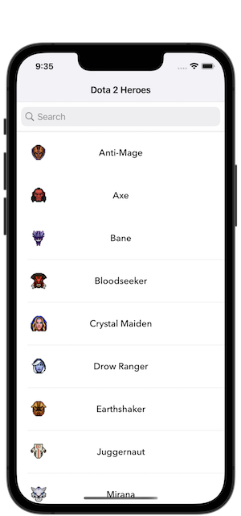
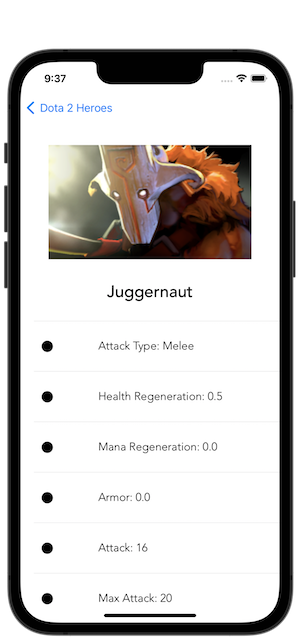
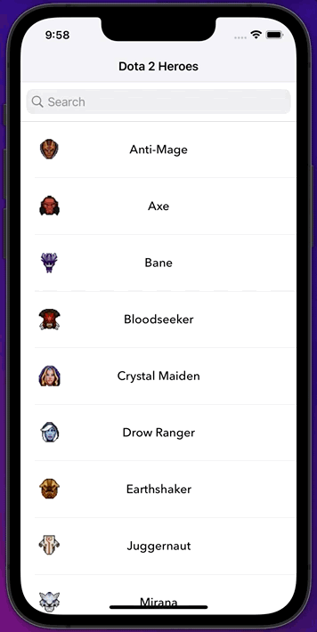

# Dota 2 Hero Searcher
Dota2HeroSearcher is a mobile application for searching heroes and heroes' stats in the Dota 2 game, created with the **Swift programming language**, **UIKit framework**, and [OpenDota API](https://docs.opendota.com/).

## Description
- Used **MVC Design Pattern**.
- Used **UITableView** to show heroes and their stats.
- Fetched images and icons of heroes from the API.

## Requirements
- Swift 5.1
- IOS 13.0
- Make sure you have an internet connection.

## Screenshots

## License

Dota2HeroSearcher is available under the MIT license. See the LICENSE file for more info.

## Authors

- [@tahabozdemir](https://www.github.com/tahabozdemir)

## Support

For support, email taha@bozdemir.net

